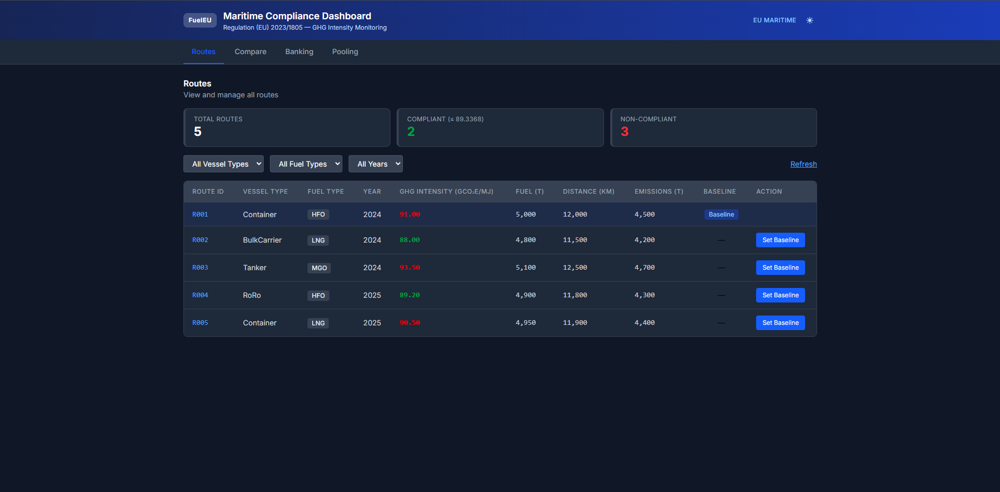
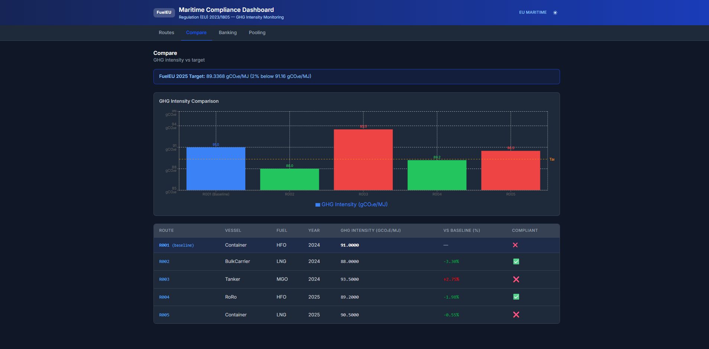
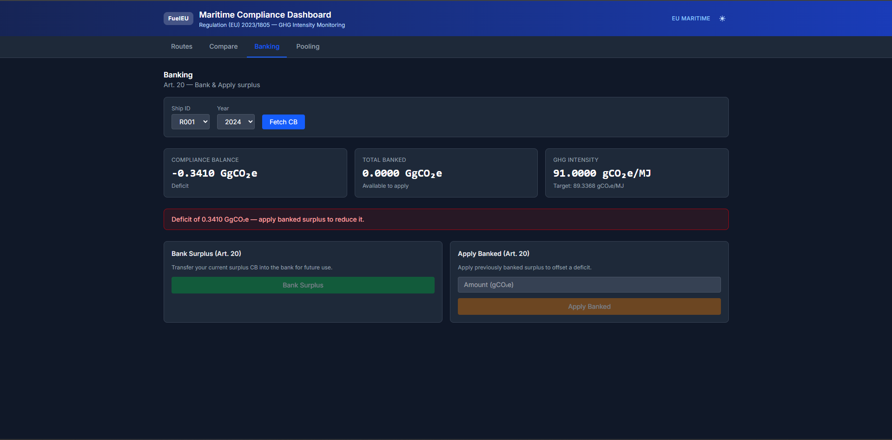
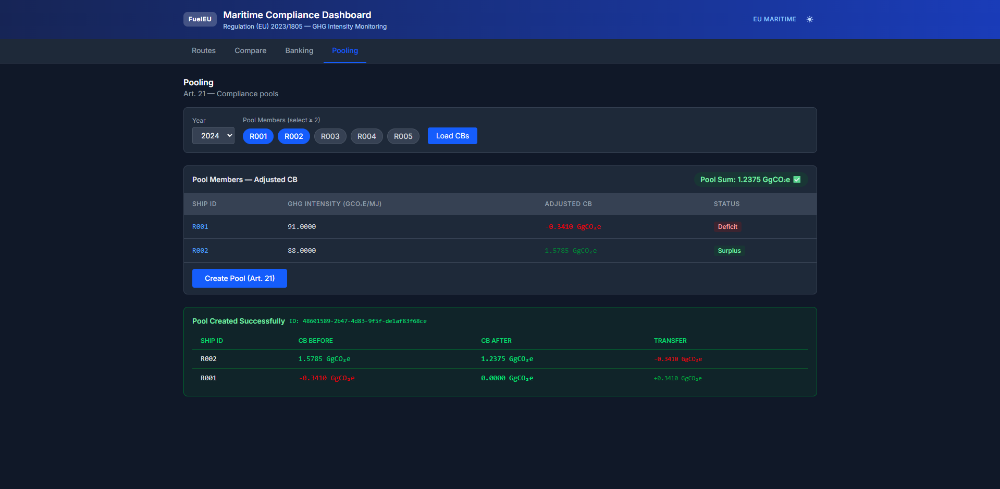

# FuelEU Maritime Compliance Platform

A full-stack implementation of the FuelEU Maritime compliance module (Regulation (EU) 2023/1805), covering GHG intensity monitoring, compliance balance calculation, banking (Article 20), and pooling (Article 21).

---

## Screenshots

### Routes — GHG intensity monitoring with compliance status


### Compare — Baseline vs fleet bar chart


### Banking — Article 20 surplus banking & application


### Pooling — Article 21 compliance pool creation


---

## Architecture

Both frontend and backend follow **Hexagonal Architecture** (Ports & Adapters / Clean Architecture):

```
core/           Pure business logic — no framework dependencies
  domain/       Entities, value objects, pure functions (CB formula, pool allocation)
  application/  Use-cases — orchestrate domain + ports
  ports/        Interfaces that adapters must implement

adapters/
  inbound/      HTTP layer (Express routers) — calls use-cases
  outbound/     Postgres repositories — implement core ports
  ui/           React components and pages — implement frontend ports
  infrastructure/ API client — implements IApiPort

infrastructure/
  db/           Migration + seed scripts
  server/       Express app + DI wiring
```

**Key rule:** `core/` never imports from `adapters/` or `infrastructure/`. Dependency always flows inward.

---

## Tech Stack

| Layer | Technology |
|-------|-----------|
| Frontend | React 19, TypeScript 5.9, Vite 8, Tailwind CSS v4, Recharts |
| Backend | Node.js, Express 5, TypeScript 5.9, pg (node-postgres) |
| Database | PostgreSQL 16 (Docker) |
| Testing | Jest + ts-jest (backend), React Testing Library (frontend) |

---

## Prerequisites

- [Node.js](https://nodejs.org/) v20+
- [Docker Desktop](https://www.docker.com/products/docker-desktop/) (for the database)

---

## Setup & Run

### 1. Start the database

```bash
# From the repo root
docker-compose up -d
# Wait for the healthcheck to pass (~5 seconds)
```

### 2. Backend

```bash
cd backend
cp .env.example .env      # already configured for the Docker compose DB
npm install
npm run db:migrate        # creates all tables
npm run db:seed           # seeds the 5 routes from spec
npm run dev               # starts on http://localhost:3001
```

### 3. Frontend

```bash
cd frontend
npm install
npm run dev               # starts on http://localhost:5173
```

Open [http://localhost:5173](http://localhost:5173).

---

## Manual Postgres (no Docker)

If you prefer a local Postgres instance:

```bash
createdb fueleu_db
# Edit backend/.env:
DATABASE_URL=postgresql://<user>:<password>@localhost:5432/fueleu_db
```

Then run the migrate + seed scripts as above.

---

## Running Tests

### Backend

```bash
cd backend
npm test                  # 30 tests (19 unit + 11 integration)
npm run test:coverage     # with coverage report
```

### Frontend

```bash
cd frontend
npm test
```

---

## API Reference

### Routes

| Method | Path | Description |
|--------|------|-------------|
| `GET` | `/routes` | All routes |
| `POST` | `/routes/:id/baseline` | Set a route as baseline |
| `GET` | `/routes/comparison` | Baseline vs all others |

### Compliance

| Method | Path | Description |
|--------|------|-------------|
| `GET` | `/compliance/cb?shipId=R001&year=2024` | Compute & store CB |
| `GET` | `/compliance/adjusted-cb?shipId=R001&year=2024` | CB + banked surplus |

### Banking (Article 20)

| Method | Path | Description |
|--------|------|-------------|
| `GET` | `/banking/records?shipId=R001&year=2024` | Bank entries |
| `POST` | `/banking/bank` | Bank positive CB `{ shipId, year }` |
| `POST` | `/banking/apply` | Apply banked to deficit `{ shipId, year, amount }` |

### Pooling (Article 21)

| Method | Path | Description |
|--------|------|-------------|
| `POST` | `/pools` | Create pool `{ year, shipIds: string[] }` |

### Sample Requests & Responses

**GET /routes**
```bash
curl http://localhost:3001/routes
```
```json
[
  { "id": "...", "routeId": "R001", "vesselType": "Container", "fuelType": "HFO",
    "year": 2024, "ghgIntensity": 91, "fuelConsumption": 5000,
    "distance": 12000, "totalEmissions": 4500, "isBaseline": true },
  { "id": "...", "routeId": "R002", "vesselType": "BulkCarrier", "fuelType": "LNG",
    "year": 2024, "ghgIntensity": 88, "fuelConsumption": 4800,
    "distance": 11500, "totalEmissions": 4200, "isBaseline": false }
]
```

**GET /compliance/cb — surplus ship (R002, LNG)**
```bash
curl "http://localhost:3001/compliance/cb?shipId=R002&year=2024"
```
```json
{
  "shipId": "R002",
  "year": 2024,
  "ghgIntensityActual": 88,
  "ghgIntensityTarget": 89.3368,
  "energyInScope": 196800000,
  "cbGco2eq": 263128320
}
```
> Positive CB = surplus. (89.3368 − 88) × (4800 × 41000) = +263,128,320 gCO₂e

**GET /compliance/cb — deficit ship (R001, HFO)**
```bash
curl "http://localhost:3001/compliance/cb?shipId=R001&year=2024"
```
```json
{
  "shipId": "R001",
  "year": 2024,
  "ghgIntensityActual": 91,
  "ghgIntensityTarget": 89.3368,
  "energyInScope": 205000000,
  "cbGco2eq": -340944000
}
```
> Negative CB = deficit. (89.3368 − 91) × (5000 × 41000) = −340,944,000 gCO₂e

**POST /banking/bank — bank R002's surplus**
```bash
curl -X POST http://localhost:3001/banking/bank \
  -H "Content-Type: application/json" \
  -d '{"shipId":"R002","year":2024}'
```
```json
{ "shipId": "R002", "year": 2024, "cbBefore": 263128320, "banked": 263128320, "cbAfter": 0 }
```

**GET /routes/comparison**
```bash
curl http://localhost:3001/routes/comparison
```
```json
[
  {
    "baseline": { "routeId": "R001", "ghgIntensity": 91, ... },
    "comparison": { "routeId": "R002", "ghgIntensity": 88, ... },
    "percentDiff": -3.2967,
    "compliant": true
  }
]
```

**POST /pools — create a compliance pool**
```bash
curl -X POST http://localhost:3001/pools \
  -H "Content-Type: application/json" \
  -d '{"year":2024,"shipIds":["R001","R002"]}'
```
```json
{
  "id": "...",
  "year": 2024,
  "members": [
    { "shipId": "R002", "cbBefore": 263128320, "cbAfter": 0 },
    { "shipId": "R001", "cbBefore": -340944000, "cbAfter": -77815680 }
  ],
  "createdAt": "2024-03-13T..."
}
```

---

## Core Formulas

```
Target GHG Intensity (2025) = 89.3368 gCO₂e/MJ   (2% below 91.16)
Energy in Scope (MJ)        = fuelConsumption (t) × 41 000 MJ/t
Compliance Balance (gCO₂e)  = (Target − Actual) × Energy in Scope

Positive CB → Surplus
Negative CB → Deficit
```

---

## AI Agent Usage

See [AGENT_WORKFLOW.md](./AGENT_WORKFLOW.md) for full documentation of AI agent prompts, outputs, corrections, and observations.

See [REFLECTION.md](./REFLECTION.md) for a short essay on lessons learned.
